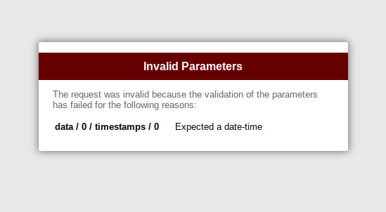

# What problem does this gem try to solve?

Let's say we expect a JSON body that contains an array of objects which contain - besides others - an array of timestamps (date-times), e.g.:

```json
[
  {
    "type": "maxima",
    "timestamps": [
      "2020-03-01T16:49:50+01:00",
      "2020-02-28T16:50:22+01:00"
    ]
  },
  {
    "type": "minima",
    "timestamps": [
      "2020-02-29T16:51:12+01:00"
    ]
  }
]
```

Validating such a request requires a lot of code, involving a lot of `is_a?` statements etc. This is both - annoying from a developer perspective and error prone.

# How does this gem solve this issue?

This gem introduces a simple way to annotate controller actions with declarative parameter type annotations. For the example shown above, it would look like this:

```ruby
action do
  body_param :data, ArrayType({ type: [:minima, :maxima], timestamps: ArrayType(DateTime) })
end
def sample_action
  render json: { status: :ok }
end
```

This will check the body parameter `:data` and will convert all string representing the timestamps automatically to `DateTime` objects. If the request does not match the definition, it will render either a JSON or HTML response which nicely describes what parameter does not match and why, e.g.:

```sh
$ curl -X POST -d \
 '{"data": [{"type": "maxima","timestamps": ["2020-03-01T16:49:50+01:00","2020-02-28T16:50:22+01:00"]},{"type": "minima","timestamps": ["2020-02-29T16:51:12+01:00"]}]}' \
 -H "Content-Type: application/json" \
 -H "Accept: application/json" \
 http://localhost:3000/sample_action
```

returns `{"status": "ok"}`. But if we send an invalid value, we get a different response:

```sh
$ curl -X POST -d \
 '{"data": [{"type": "maxima","timestamps": ["abc","2020-02-28T16:50:22+01:00"]},{"type": "minima","timestamps": ["2020-02-29T16:51:12+01:00"]}]}' \
 -H "Content-Type: application/json" \
 -H "Accept: application/json" \
 http://localhost:3000/home
```
the server will answer:
```json
{
    "errors": [
        {
            "message": "Expected a date-time",
            "path": "data/0/timestamps/0"
        }
    ],
    "status": "fail"
}
```

If we do not request `application/json`, we get an HTML response which looks like this:

